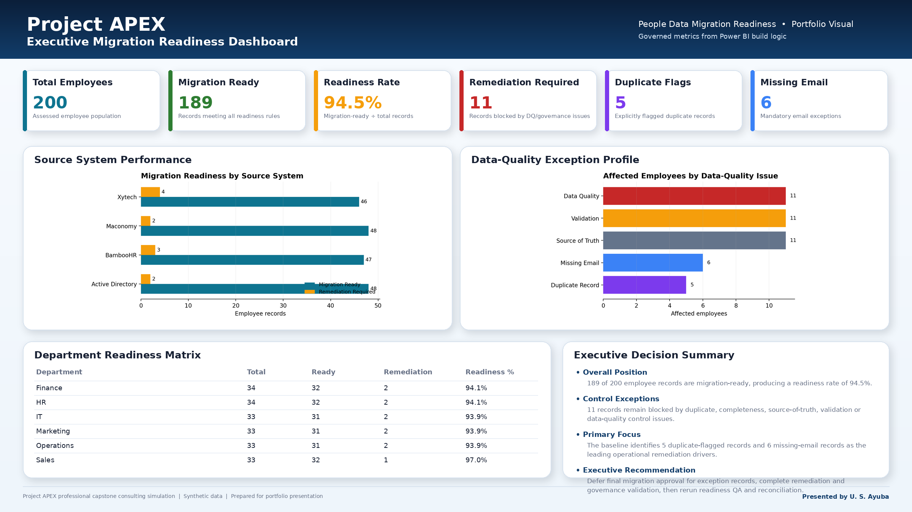
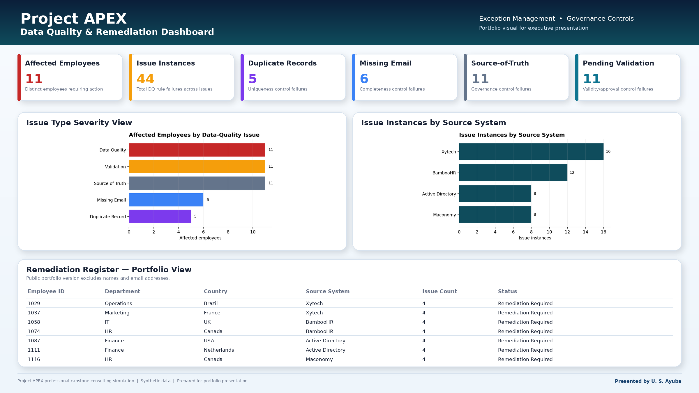
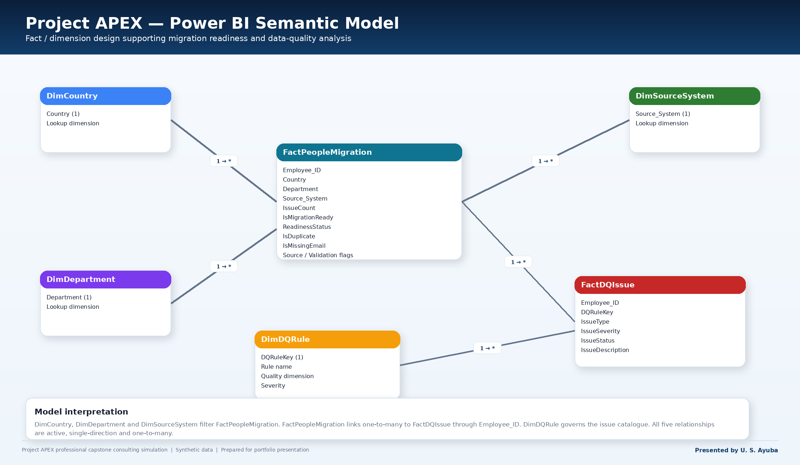

# U. S. Ayuba

## Principal Data Analytics Consultant | Executive BI, Data Quality & Decision Intelligence

**Power BI · SQL · Tableau · Data Modelling · KPI Frameworks · Reporting Automation · Data Quality · Executive Reporting**

I am a strategic data analytics consultant with **10+ years of international experience** helping organisations transform operational data into executive decision intelligence. I design analytics solutions that connect data quality, modelling, business intelligence and KPI reporting to measurable operational decisions.

My delivery approach combines **technical depth, commercial awareness, stakeholder engagement and controlled handover**, from data profiling and SQL transformation through semantic modelling, dashboard development, executive insight and governance.

## Executive Analytics Capabilities

- **Business Intelligence:** Power BI, Tableau, SSRS and executive dashboard design
- **SQL & Data Modelling:** scalable analytical datasets, transformations and business-rule implementation
- **Data Quality & Migration:** profiling, duplicate detection, completeness checks, source-of-truth validation and reconciliation
- **KPI & Performance Analytics:** KPI frameworks, reporting automation and executive insight packs
- **Decision Intelligence:** translating operational data into clear management actions, risks and priorities
- **Delivery & Governance:** stakeholder management, Agile delivery, documentation, QA and knowledge transfer

## Flagship Portfolio Case Study — Project APEX

### Enterprise People Data Migration Readiness Analytics Pilot

**Project APEX** is a professional capstone consulting simulation demonstrating an end-to-end analytics workflow across **Excel, PostgreSQL and Power BI**.

**Business challenge:** determine whether employee master data from multiple operational systems is complete, validated, governed and sufficiently ready for migration.

| Migration Readiness KPI | Baseline |
|---|---:|
| Employee records assessed | 200 |
| Migration-ready records | 189 |
| Records requiring remediation | 11 |
| Initial migration readiness | **94.5%** |
| Duplicate-flagged records | 5 |
| Missing-email records | 6 |
| Source-of-truth not confirmed | 11 |
| Validation pending | 11 |

## Portfolio Visual Evidence

### Solution Architecture

`Business Problem → Data Profiling → Excel Controls → PostgreSQL Validation → Data Quality Rules → Power BI Semantic Model → DAX KPIs → Executive Dashboard → QA & Reconciliation → Recommendation`

### What Project APEX Demonstrates

- Business-problem definition and requirements translation
- Structured Excel data-quality assessment and remediation controls
- PostgreSQL profiling, validation and migration-readiness queries
- Data-quality rule catalogue and source-of-truth governance
- Star-schema Power BI semantic modelling
- Power Query transformation logic
- DAX KPI measures and executive reporting
- Cross-tool reconciliation and controlled QA
- Executive migration recommendation and handover documentation

> **Portfolio integrity:** Project APEX uses synthetic data and is presented as a professional capstone consulting simulation, not as paid client experience.

## Selected Professional Evidence

- Delivered executive **Power BI dashboards across 10,000+ records**, eliminating a reporting backlog within contract timelines.
- Designed scalable **SQL data models supporting analysis for more than 1,000 customers**.
- Developed scalable SQL datasets supporting **800+ customer records**.
- Implemented **SSRS and Tableau dashboards monitoring 30+ operational and financial KPIs**.
- Produced **30+ analytical reports and executive workforce insight packs** supporting leadership decisions.
- Led optimisation initiatives associated with an **80% improvement in operational recovery performance**.

## Professional Credentials

- **MSc Data Analytic Management** — 2024
- **CompTIA A+** — UK
- **National Diploma, Social Science** — 2006
- **Business Management** — In Progress

## How I Approach Analytics

I focus on the full decision lifecycle rather than isolated reporting:

**Business objective → governed data → analytical model → KPI framework → insight → action → validation → handover**

This approach supports executive visibility, operational improvement, data-quality control and scalable analytical delivery.

## Professional Focus

**Principal Data Analytics Consultant / Senior Analytics Contract Opportunities**

UK & Global · Remote · Hybrid · Contract

## Connect

- **LinkedIn:** https://www.linkedin.com/in/u-s-ayub

